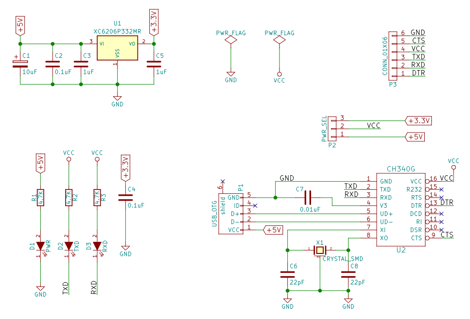
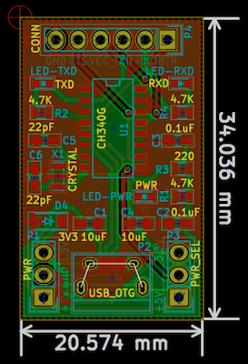
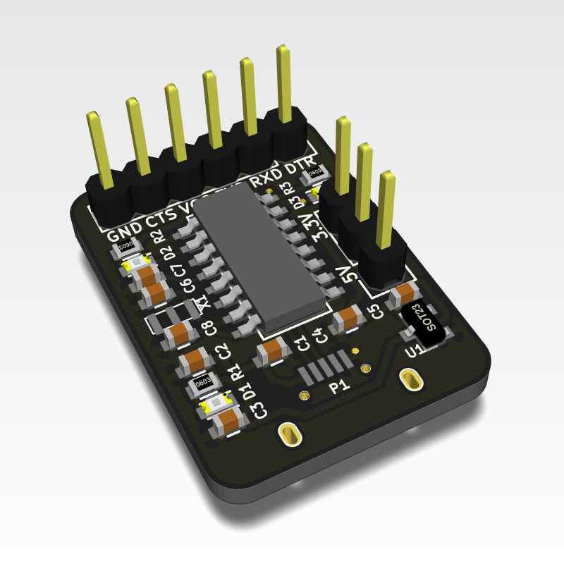

## USB2TTL-CH340G

这是采用CH340G芯片的USB转UART模块的KiCAD工程设计文件，同时可以作为Arduino下载器。

#### 目标功能

1. 通用的usb转uart功能
2. 为Arduino下载程序
3. 自由选择3.3V或5V供电，并可输出。
4. 电源LED指示、TX和RX的LED指示

#### 原理图

#### PCB

#### PCB的3D预览

#### 附：

[CH340](http://www.wch.cn/product/CH340.html) 是一个 USB 总线的转接芯片,实现 USB 转串口、USB 转 IrDA 红外或者 USB 转打印口，其中设计中采用的CH340G是一款只有USB转串口功能的芯片。